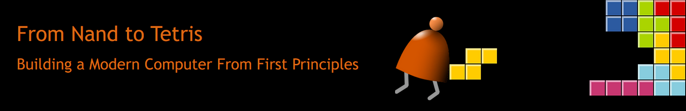

# nand2tetris



## What is nand2tetris

**"nand2tetris" (From Nand to Tetris)** is a collection of projects that let student **build a computer from scratch**. It is a hands-on journey that starts with the most elementary logic gate, called **Nand**. and ends up, 12 projects later, with a **general-purpose computer system capable of running Tetris**. Specifically, the 12 projects are:

## Navigation

1. [Boolean Logic](https://github.com/ret2basic/From-Nand-to-Tetris/tree/main/projects/01)
2. [Boolean Arithmetic](https://github.com/ret2basic/From-Nand-to-Tetris/tree/main/projects/02)
3. [Memory](https://github.com/ret2basic/From-Nand-to-Tetris/tree/main/projects/03)
4. [Machine Language](https://github.com/ret2basic/From-Nand-to-Tetris/tree/main/projects/04)
5. [Computer Architecture](https://github.com/ret2basic/From-Nand-to-Tetris/tree/main/projects/05)
6. [Assembler](https://github.com/ret2basic/From-Nand-to-Tetris/tree/main/projects/06)
7. [Virtual Machine I: Processing](https://github.com/ret2basic/From-Nand-to-Tetris/tree/main/projects/07)
8. [Virtual Machine II: Control](https://github.com/ret2basic/From-Nand-to-Tetris/tree/main/projects/08)
9. [High-Level Language](https://github.com/ret2basic/From-Nand-to-Tetris/tree/main/projects/09)
10. [Compiler I: Syntax Analysis](https://github.com/ret2basic/From-Nand-to-Tetris/tree/main/projects/10)
11. [Compiler II: Code Generation](https://github.com/ret2basic/From-Nand-to-Tetris/tree/main/projects/11)
12. [Opearting System](https://github.com/ret2basic/From-Nand-to-Tetris/tree/main/projects/12)

## Part I: Hardware

Part I covers project 1 to 6. In this part, we are going to implement the hardware architecture for our Hack computer. In particular, we are going to build:

1. **Logical gates:** project 1
2. **ALU and memory devices:** project 2 and 3
3. **Hack machine language:** project 4
4. **CPU and RAM:** project 5
5. **Hack assembler:** project 6

## Part II: Software

Part II covers project 7 to 12. In this part, we are going to implement **Jack**, a *simple*, *Java-like*, *object-based* programming language. As with programming languages like Java and C#, the Jack compiler will be *two-tiered*:

1. The **Hack compiler** will generate interim **bytecode**, designed to run on an abstraction **virtual machine (VM)**.
2. The bytecode will then be compiled further by a separate **VM translator** into the **Hack machine language**.

Pictorially:

```
             Compiler            VM            Assembler
Source Code ---------> Bytecode ----> Assembly --------> Binary
```

The languaeg that we are going to implement, Jack, has the following syntax:

```
// First example in Programming 101
class Main {
  function void main() {
    do Output.printString("Hello World");
    return;
  }
}
```

In Part II, we are going to build:

1. **VM translator:** project 7-8
2. **BreakOut game written in Jack:** project 9
3. **Jack compiler:** project 10-11
4. **Operating system:** project 12
