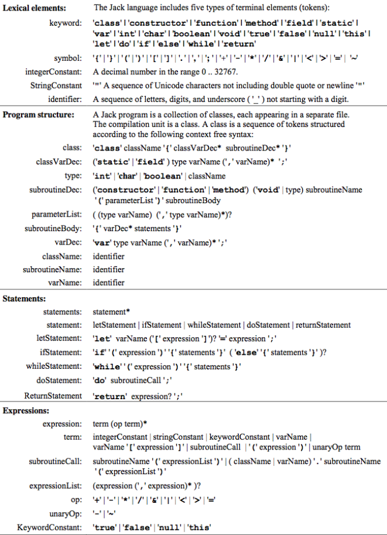

# Chapter 10: Compiler I Syntax Analysis

## Overview

The previous chapter introduced Jack: a simple, object-based programming language with a Java-like syntax. In this chapter we start building a compiler for the Jack language.

> A **compiler** is a program that translates programs from a source language into a target machine.

The translation process, known as **compilation**, is conceptually based on two distinct tasks:

1. We have to understand the syntax of the source program => **syntax analysis**
2. From it, uncover the program's semantics => **code generation**

For example, the parsing of the code can reveal that the program seeks to declare an array or manipulate an object. Once we know the semantics, we can reexpress it using the syntax of the target language. The first task, typically called syntax analysis, is described in this chapter; the second task, code generation, is taken up in the next chapter.

## Background

Compilation consists of two main stages

1. **Syntax Analysis**
   1. Tokenizing: the grouping of input characters into language atoms called tokens
   2. Parsing: the grouping of tokens into structured statements that have a meaning
2. **Code Generation**

The tokenizing and parsing tasks are completely independent of the target language into which we seek to translate the source input. Since in this chapter we don't deal with code generation, we have chosen to **have the syntax analyzer output the parsed structure of the input program as an XML file**. This decision has two benefits:

1. The ouput file can be readily inspected, demonstrating that the syntax analyzer is parsing source programs correctly.
2. The requirement to output this file explicitly forces us to write the syntax analyzer in an architecture that can be later morphed into a full-scale compiler.

### Lexical Analysis

Each programming language specification includes the types of **tokens**, or words, that the language recognizes. In the Jack language, tokens fall into 5 categories:

1. **Keywords:** like `class` and `while`
2. **Symbols:** like `+` and `<`
3. **Integer Constants:** like `17` and `314`
4. **String Constants:** like `"FAQ"` and `"Frequently Asked Questions"`
5. **Identifiers:** the textual labels used for naming variables, classes, and subroutines

Taken together, the tokens defined by these lexical categories can be referred to as the language **lexicon**.

In its plaintext form, a computer program is a stream of characters stored in a text file. The first step in analyzing the program's syntax is grouping the characters into tokens, as defined by the language lexicon, while ignoring white space and comments. This task is called:

- **Lexical Analysis**
- **Scanning**
- **Tokenizing**

All meaning exactly the same thing.

Definition of the Jack lexicon:

- `keyword`
  - 'class'
  - 'constructor'
  - 'function'
  - 'method'
  - 'field'
  - 'static'
  - 'var'
  - 'int'
  - 'char'
  - 'boolean'
  - 'void'
  - 'true'
  - 'false'
  - 'null'
  - 'this'
  - 'let'
  - 'do'
  - 'if'
  - 'else'
  - 'while'
  - 'return'
- `symbol`:
  - '{'
  - '}'
  - '('
  - ')'
  - '['
  - ']'
  - '.'
  - ','
  - ';'
  - '+'
  - '-'
  - '*'
  - '/'
  - '&'
  - '|'
  - '<'
  - '>'
  - '='
  - '~'
- `integerConstant`: a decimal integer in the range 0...32767
- `stringConstant`: '"'a sequence of characters
- `identifier`: a sequence of letters, digits, and underscore (`_`), not starting with a digit.

### Grammars

Once we develop the ability to access a given text as a stream of tokens, or words, we can proceed to attempt grouping the words into valid sentences. A grammar is written in a **meta-language**: a language describing a language. Trying to keep things simple, in nand2tetris we view a grammar as a set of rules. **Each rule consists of a left side and a right side.**

The **left side** specifies the rule's name, which is not part of the language. Rather, it is made up by the person who describes the grammar, and thus it is not terribly important. For example, if we replace a rule's name with another name throughout the grammar, the grammar will be just as valid.

the rule's **right side** describes the lingual pattern that the rule specifies. This pattern is a left-to-right sequence consisting of three building blocks:

- **Terminals:** tokens, like `if`
- ****Nonterminals:** names of other rules, like `expression`
- **Qualifiers:** `|`, `*`, `?`, `(`, `)`

For example, the rule `ifStatement: 'if' '(' expression ')' '{' statements '}'` stipulates that every valid instance of an `ifStatement` must:

- Begin with the token `if`
- Followed by the token `(`
- Followed by a valid instance of an `expression` (defined elsewhere in the grammar)
- Followed by the token `)`
- Followed by the token `{`
- Followed by a valid instance of `statements` (defined elsewhere in the grammar)
- Followed by the token `}`.

When there is more than one way to parse a pattern, we use the qualifier `|` to list the alternatives. The qualifier `*` is used to denote "0, 1, or more times". In a similar vein, the qualifier `?` is used to denote "0 or 1 times".

A subset of Jack grammar:

- `statements: statement*`
- `statement: letStatement | ifStatement | whileStatement`
- `letStatement: 'let' varName '=' expression ';'`
- `ifStatement: `if '(' expression ')' '{' statements '}'`
- `whileStatement: 'while' '(' expression ')' '{' statements '}'`
- `expression: term(op term)?`
- `term: varName | constant`
- `varName: a string not beginning with a digit`
- `constant: a non-negative integer`
- `op: '+' | '-' | '=' | '>' | '<'`

### Parsing


### Parser


## Specification

This section consists of two parts. First, we specify the Jack language's grammar. Next, we specify a syntax analyzer designed to parse programs according to this grammar.

### The Jack Language Grammar

The grammar uses the following notation:

- `'xxx'`: Represents language tokens that appear verbatim
- `xxx`  : Reprsents names of terminal and nonterminal elements
- `()`   : Used for grouping
- `x|y`  : Either `x` or `y`
- `x y`  : `x` is followed by `y`
- `x?`   : `x` appears 0 or 1 times
- `x*`   : `x` appears 0 or more times

With this notation in mind, the complete Jack grammar is specified in the following table:



### A Syntax Analyzer for the Jack Language

**A syntax analyzer is a program that performs both tokenizing and parsing.** In Nand to Tetris, the main purpose of the syntax analyzer is to process a Jack program and understand its syntactic structure according to the Jack grammar.

Usage:

```shell
prompt>JackAnalyzer source
```

where `source` is either a file name of the form `Xxx.jack` or the name of a folder containing one or more `.jack` files.

## Implementation

**Handout:** https://www.nand2tetris.org/project10

In Project 10, we are going to implement the syntax analysis part of the Jack compiler. Specifically, we implement the following modules:

- `jack_analyzer`: main program that sets up and invokes the other modules
- `jack_tokenizer`: tokenizer
- `compilation_engine`: recursive top-down parser

### The JackTokenizer

This module ignores all comments and white space in the input stream and enables accessing the input one token at a time. Also, it parses and provides the type of each token, as defined by the Jack grammar.

| Routine | Arguments | Returns | Function |
| Constructor / initializer | Input file / stream | - | Opens the input `.jack` file / stream and gets ready to tokenize it. |
| `has_more_tokens` | - | boolean | Are there more tokens in the input? |
| `advance` | - | - | Gets the next token from the input, and makes it the current token. This method should be called only if `has_more_tokens` is True. Initially there is no current token. |
| `token_type` | - | `KEYWORD`, `SYMBOL`, `IDENTIFIER`, `INT_CONST`, `STRING_CONST` | Returns the type of the current token, as a constant. |
| `key_word` | - | `CLASS`, `METHOD`, `FUNCTION`, `CONSTRUCTOR`, `INT`, `BOOLEAN`, `CHAR`, `VOID`, `VAR`, `STATIC`, `FIELD`, `LET`, `DO`, `IF`, `ELSE`, `WHILE`, `RETURN`, `TRUE`, `FALSE`, `NULL`, `THIS` | Returns the keyword which is the current token, as a constant. This method should be called only if `token_type` is `KEYWORD`. |
| `symbol` | - | char | Returns the character which is the current token. Should be called only if `token_type` is `SYMBOL`. |
| `identifier` | - | string | Returns the string which is the current token. Should be called only if `token_type` is `IDENTIFIER`. |
| `int_val` | - | int | Returns the integer value of the current token. Should be called only if `token_type` is `INT_CONST`. |
| `string_val` | - | string | Returns the string value of the current token, without the opening and closing double quotes. Should be called only if `token_type` is `STRING_CONST`. |

### The CompilationEngine


| Routine | Arguments | Returns | Function |
| ------- | --------- | ------- | -------- |
| Constructor / initializer | Input file / stream, Output file / stream | - | Creates a new compilation engine with the given input and output. The next routine called (by the `JackAnalyzer` module) must be `compileClass`. |
| `compile_class` | - | - | Compiles a complete class. |
| `compile_class_var_dec` | - | - | Compiles a static variable declaration, or a field declaration. |
| `compile_subroutine` | - | - | Compiles a complete method, function, or constructor. |
| `compile_parameter_list` | - | - | Compiles a (possibly empty) parameter list. Does not handle the enclosing parentheses tokens `(` and `)`. |
| `compile_subroutine_body` | - | - | Compiles a subroutine's body. |
| `compile_var_dec` | - | - | Compiles a `var` declaration. |
| `compile_statements` | - | - | Compiles a sequence of statements. Does not handle the enclosing curly bracket tokens `{` and `}`. |
| `compile_let` | - | - | Compiles a `let` statement. |
| `compile_if` | - | - | Compiles an `if` statement, possibly with a trailing `else` clause. |
| `compile_while` | - | - | Compiles a `while` statement. |
| `compile_do` | - | - | Compiles a `do` statement. |
| `compile_return` | - | - | Compiles a `return` statement. |
| `compile_expression` | - | - | Compiles an expression. |
| `compile_term` | - | - | Compiles a `term`. If the current token is an `identifier`, the routine must resolve it into a `variable`, an `array element`, or a `subroutine call`. A single lookahead token, which may be `[`, `(`, or `.`, suffices to distinguish between the possibilities. Any other token is not part of this term and should not be advanced over.
| `compile_expression_list` | - | int | Compiles a (possibly empty) comma-separated list of expressions. Returns the number of expressions in the list. |

### The JackAnalyzer

This is the main program that drives the overall syntax analysis process, using the services of a `JackTokenizer` and a `CompilationEngine`. For each source `Xxx.jack` file, the analyzer:

1. Creates a `JackTokenizer` from the `Xxx.jack` input file.
2. Creates an output file named `Xxx.xml`.
3. Uses the `JackTokenizer` and the `CompilationEngine` to parse the input file and write the parsed code to the output file.
